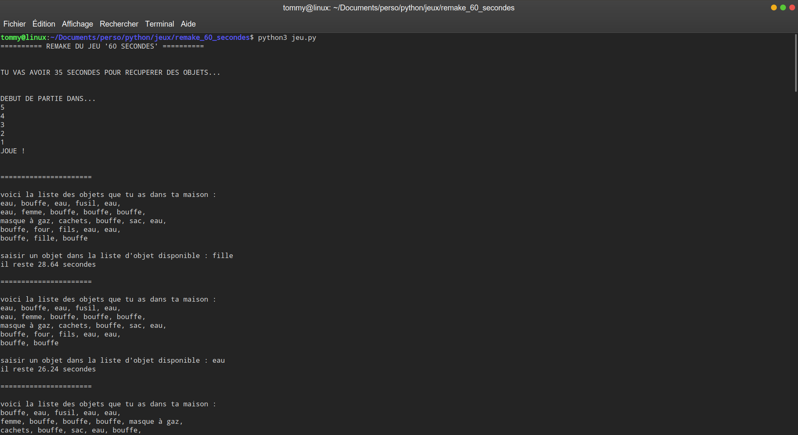
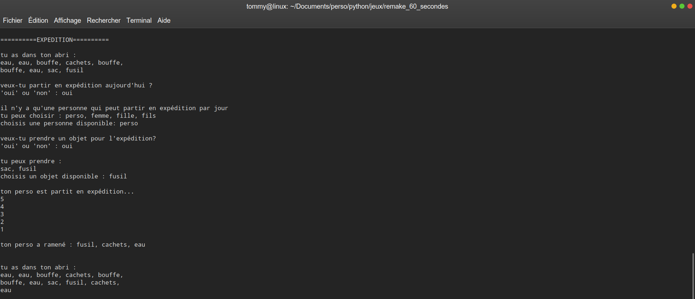
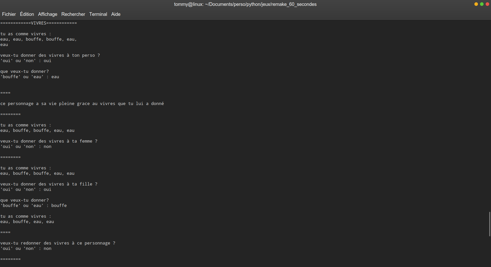
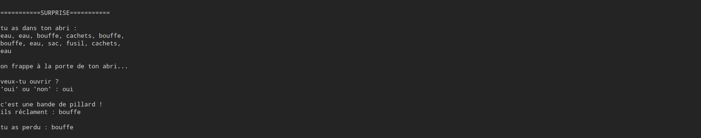

# Remake of the " 60 seconds ! "

This project is a remake of the game " 60 seconds ! ". 

I did it in 2018, during my 2nd year of university license. This is a personnal project, and is developed in Python3. This project is finished.

## Rules
There is an atomic bomb going to fall on your city. You have 30 seconds to recover your family, food and other things to survive in your atomic bomb shelter.

You can go on an expedition to recover some food, give food to your family. You have to survive as long as possible.

## To begin
Do the command :  `$ git clone https://github.com/debroucker/remake_60_seconds.git` to recover this repository.

## Prerequisite
You need to have Python3.
So, if you haven't it, do the command : `$ sudo apt-get install python3`

## Start-up
To launch the game, do the command : `$ python3 src/jeu.py` in the main directory, and enjoy.

## Made with
Visual Studio Code

## Authors
DEBROUCKER Tommy
